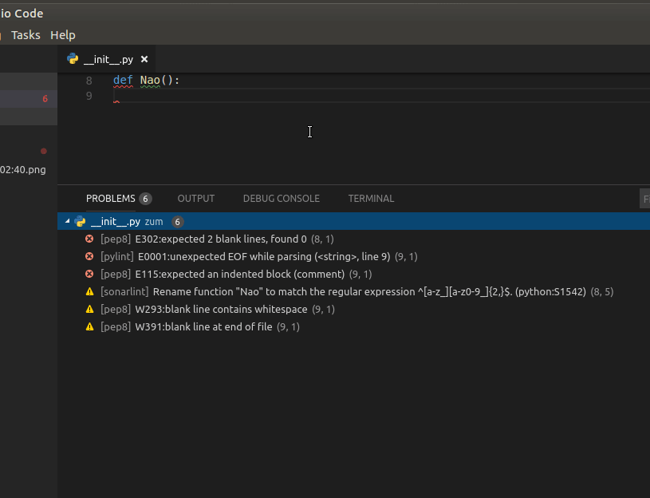
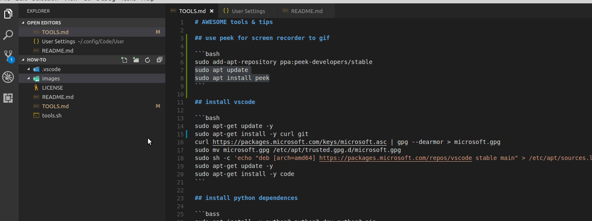

# AWESOME tools & tips

## use peek for screen recorder to gif

```bash
sudo add-apt-repository ppa:peek-developers/stable
sudo apt update
sudo apt install peek
```

## install vscode

```bash
sudo apt-get update -y
sudo apt-get install -y curl git
curl https://packages.microsoft.com/keys/microsoft.asc | gpg --dearmor > microsoft.gpg
sudo mv microsoft.gpg /etc/apt/trusted.gpg.d/microsoft.gpg
sudo sh -c 'echo "deb [arch=amd64] https://packages.microsoft.com/repos/vscode stable main" > /etc/apt/sources.list.d/vscode.list'
sudo apt-get update -y
sudo apt-get install -y code
```

## install python dependences

```bass
sudo apt install -y python3 python3-dev python3-pip
sudo apt install -y freetds-dev freetds-bin freetds-common
sudo apt install -y openjdk-8-jdk openjdk-8-jre
sudo pip3 install yapf autopep8 pylint flake8
sudo pip3 install pytest pytest-cov requests python-dateutil
sudo pip3 install python-tds pymssql ujson
```

## vscode config example

```json
{
    "python.autoComplete.addBrackets": true,
    "python.pythonPath": "python3",
    "sonarlint.ls.javaHome": "/usr/lib/jvm/java-8-openjdk-amd64/",
    "sonarlint.ls.vmargs": "-Xmx1024m",
    "pydocs.style": "google",
    "git.autofetch": true,
    "templateGenerator.fields.author": "Gustavo M Freitas",
    "templateGenerator.fields.email": "gustavomf@ciandt.com",
    "templateGenerator.fields.link": "https://github.com/gustavomf-cit",
    "git.enableSmartCommit": true,
    "python.linting.flake8Enabled": true,
    "python.linting.pylintEnabled": true,
    "window.zoomLevel": 0,
    "python.unitTest.promptToConfigure": false,
    "python.unitTest.pyTestEnabled": false,
    "editor.codeLens": true,
    "workbench.editor.labelFormat": "default",
    "workbench.iconTheme": "vscode-icons",
    "tidyMarkdown.disableFormatter": false,
    "python.formatting.autopep8Path": "autopep8",
    "python.formatting.provider": "autopep8",
    "python.linting.pep8Enabled": true,
    "explorer.confirmDelete": false
}
```

## plugins

- bash beautify (ahmed hamdy)
- excel viewer(grapecity)
- git history(don jayamanne)
- markdownlint/markdown all in one (david anson/yu zhang)
- python (from microsoft)
- sonarlint (sonarsource)

```bash
code --install-extension shakram02.bash-beautify
code --install-extension GrapeCity.gc-excelviewer
code --install-extension donjayamanne.githistory
code --install-extension yzhang.markdown-all-in-one
code --install-extension DavidAnson.vscode-markdownlint
code --install-extension ms-python.python
code --install-extension SonarSource.sonarlint-vscode
code --install-extension robertohuertasm.vscode-icons
code --install-extension azaugg.vscode-python-docstring
code --install-extension DotJoshJohnson.xml
code --install-extension codezombiech.gitignore
code --install-extension eamodio.gitlens
code --install-extension DengSir.template-generator-vscode
```

## install sonar by command line, it will install jars dependences automatically



## vscode key bind example for generate def docs ... google style

keybindings.json

```json
[
    {
        "key": "ctrl+1",
        "command": "extension.addPyDocstring"
    }
]
```



## template generator

To create file with template
type: alt+control+n
write field: the name of file or folder
option: choose python.py or anything else

```bash
machine:~/github/how-to$ cat ~/.vscode/templates/\{__name__.python\}.py
#!/usr/bin/env python3
# -*- coding: utf-8 -*-
#
# {__name__}.py
# @Author : {__author__} ({__email__})
# @Link   : {__link__}
# @Date   : {__date__}
machine:~/github/how-to$
```

